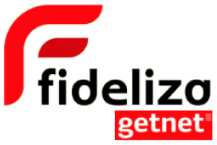
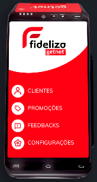
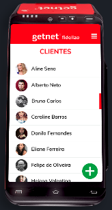
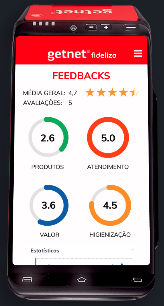

# Fideliza

Uma solução integrada as maquininhas da Getnet para que os pequenos negócios consigam fidelizar seus clientes, sem sair da jornada que já estão acostumados junto a maquininha. O empreendedor conseguirá registrar clientes e depois promover campanhas promocionais de benefícios. O que aumentará a recorrência e fortalecimento da carteira de clientes, o que impacta diretamente seu faturamento, e ainda possibilita ter mais tempo para se dedicar aos seus produtos, serviços e a si, melhorando sua produtividade.

O empreendedor pode usar a solução, além das máquinas POS DIGITAL da Getnet, no seu celular, via web ou ainda futuramente via assistente no WhatsApp.

|  |  |
| --------------------------------------------------------- | --------------------------------------------------------- |
|  |  |

### 🔗 Links

- Canal: [Fideliza - YouTube](https://www.youtube.com/channel/UCHwZAhE024bWT-EsHsqX_pw)
- Video Pitch: [Youtube](https://youtu.be/XJq6T10gtzk)
- Video navegação no app: [Video](https://youtu.be/I8jdwIxajNs)
- Protótipo: [Figma](https://www.figma.com/proto/5DgVVpFgIACodRrhqOtjNX/GETNET?node-id=0%3A1)
- Código: [Github](https://github.com/GETNET-Fideliza/fideliza)
- Pitch: [PDF](https://storage.googleapis.com/shawee-production.appspot.com/shawee/projectfiles/9bb091c6-017f-4c94-a807-26e873534b88.pdf)
- MVP: [Experimente](https://getnet.web.app)
- Miro:  [imagem](images/miro.png)

### 🔗 Links

## ⚙ Tecnologias

- Front - [React Native](https://reactjs.org/)
- Back-end - Kotlin

## ## 💪 Time

- Daniel Leite (Designer) [LinkedIn](https://www.linkedin.com/in/daniel-leite-aa17b843/) . [Behance](https://www.behance.net/danielrodrigo)
- Léo Moraes (Business) [LinkedIn](https://www.linkedin.com/in/leohmoraes/) . [GitHub](https://github.com/leohmoraes)
- Everton Ferreira (Dev) [LinkedIn](https://www.linkedin.com/in/evertonferreira96/) . [GitHub](https://github.com/evertonferreira96)
- Sávio Sucar (Marketing) [Linkedin](https://www.linkedin.com/in/diagosucar/)
- Rafael Souza (Dev) - Anápolis/GO - [LinkedIn](https://www.linkedin.com/in/rafaelbleidi/) . [GitHub](https://github.com/bleidi)
